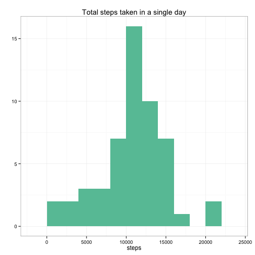
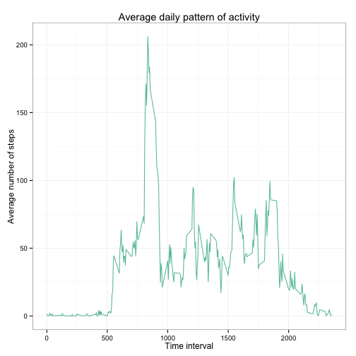
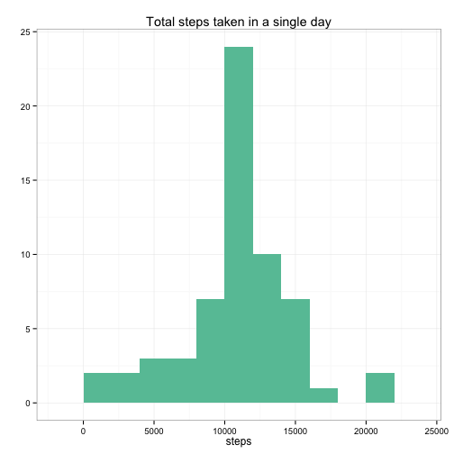
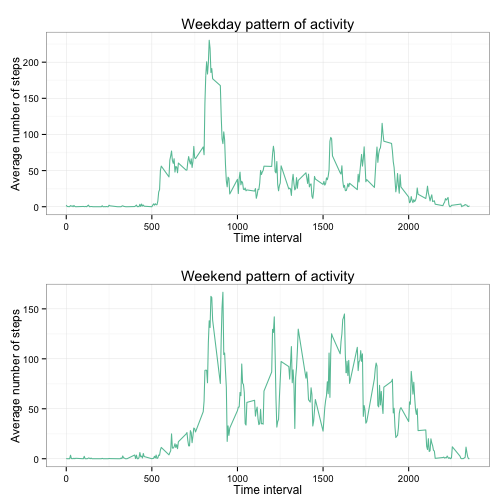

# Reproducible Research: Peer Assessment 1
First we will load the libraries that will be used for the analysis and unzip the data file if it
has not already been unzipped.


```r
library(ggplot2)
library(plyr())
library(RColorBrewer)
library(gridExtra)
```

```
## Loading required package: grid
```

```r
if (!file.exists("activity.csv")) {
  unzip("activity.zip")
}

colors <- brewer.pal(3, "Set2")
```

## Loading and preprocessing the data
Now we will load the uncleaned data into a variable called activity. We need to make some adjustments to the data. It doesn't like having the dates as simple strings, so we'll change those to dates. Also want to make sure the interval is an integer.


```r
activity <- read.csv('activity.csv')
activity$date <- as.Date(activity$date, format="%Y-%m-%d")
activity$interval <- as.numeric(activity$interval)
```
The data in activity is the number of steps that were taken in a five minute interval for a given day. So if the date is 2012-10-05 and the interval is 905 that means the number of steps recorded between the 900th and 905th minute of that day. That would be the number of steps taken between 15:00 and 15:05 on October 5, 2012.

## What is mean total number of steps taken per day?
To calcualte the mean number of steps per day we must first aggregate the data by day and get a sum of the steps. For each day in activity add the number of steps for each interval.

```r
deez_steps <- ddply(activity[!is.na(activity$steps),], .(date), summarize, total=sum(steps))
```
The mean number of steps taken per day:

```r
mean(deez_steps$total)
```

```
## [1] 10766
```
The median number of steps taken per day:

```r
median(deez_steps$total)
```

```
## [1] 10765
```
Here is a pretty picture showing the total number of steps taken each day.

```r
gg <- ggplot(deez_steps, aes(x=total)) + geom_histogram(binwidth=2000, fill=colors[1])
gg <- gg + theme_bw()
gg <- gg + labs(title="Total steps taken in a single day", x="steps", y="")
print(gg)
```

 

## What is the average daily activity pattern?
To get the average daily activity pattern we'll use the same concept above to add the number of steps. However, instead of aggregating by day, we'll aggregate by the interval time. So we will add the number of steps in the 15:00 to 15:05 interval for each day in the data set.


```r
deez_intervals <- ddply(activity[!is.na(activity$steps),], .(interval), summarize, mean=mean(steps))
gg <- ggplot(deez_intervals, aes(x=interval, y=mean)) + geom_line(color=colors[1])
gg <- gg + theme_bw()
gg <- gg + labs(title="Average daily pattern of activity", x="Time interval", y="Average number of steps")
print(gg)
```

 

There are some big spikes in there. Which time interval has the highest average number of steps?


```r
deez_intervals[deez_intervals$mean==max(deez_intervals$mean),]$interval
```

```
## [1] 835
```

## Imputing missing values
Not all of the intervals in the dataset are populated. There are a lot of NAs in there. We would like to fill in the NA values with a reasonable number. We could take the mean steps for the
day and fill that in, but that would be like adding a piece of someone's daily run to hundreds of data points. So it makes more sense to use the mean number of steps for that interval taken 
over each day. If the counter was not on for the 09:00 to 09:05 interval we will fill in the data using the mean number of steps in the 09:00 to 09:05 interval on all the other days and assume
that this person has the same basic routine every day. Plus, we've already calcualted the mean number of steps per interval in the last section.

### So how many missing values are in the dataset?

```r
sum(is.na(activity$steps))
```

```
## [1] 2304
```

### Let's fill them in.
I'm going to make a function that will return the mean number of steps for any given interval. I'm going to make a copy of the activity data and then apply my function to all of the NA values in that copy.


```r
kevdog <- function(x) { return(round(deez_intervals[deez_intervals$interval==x,]$mean))}
deez_values <- activity
deez_values[is.na(deez_values$steps),]$steps <- sapply(deez_values[is.na(deez_values$steps),]$interval, kevdog)
```
Now the deez_intervals data frame has a reasonable value for every observation.

```r
head(deez_values, 20)
```

```
##    steps       date interval
## 1      2 2012-10-01        0
## 2      0 2012-10-01        5
## 3      0 2012-10-01       10
## 4      0 2012-10-01       15
## 5      0 2012-10-01       20
## 6      2 2012-10-01       25
## 7      1 2012-10-01       30
## 8      1 2012-10-01       35
## 9      0 2012-10-01       40
## 10     1 2012-10-01       45
## 11     0 2012-10-01       50
## 12     0 2012-10-01       55
## 13     0 2012-10-01      100
## 14     1 2012-10-01      105
## 15     0 2012-10-01      110
## 16     0 2012-10-01      115
## 17     0 2012-10-01      120
## 18     1 2012-10-01      125
## 19     2 2012-10-01      130
## 20     0 2012-10-01      135
```
### How about a histogram?

```r
deez_values_days <- ddply(deez_values, .(date), summarize, total=sum(steps))
gg <- ggplot(deez_values_days, aes(x=total)) + geom_histogram(binwidth=2000, fill=colors[1])
gg <- gg + theme_bw()
gg <- gg + labs(title="Total steps taken in a single day", x="steps", y="")
print(gg)
```

 

```r
summary(deez_values_days$total)
```

```
##    Min. 1st Qu.  Median    Mean 3rd Qu.    Max. 
##      41    9820   10800   10800   12800   21200
```
## Are there differences in activity patterns between weekdays and weekends?
For my next trick I'm going to make two graphics showing the difference between activity during the week and activity on weekends. To start with, I'm going to add a column to the dataset with the day of the week. Then I'll make two charts using that data, but only taking Saturday and Sunday for the weekend chart.


```r
deez_days <- deez_values
deez_days$weekday <- weekdays(deez_days$date)
weekend_data <- deez_days[deez_days$weekday %in% c('Saturday','Sunday'),]
weekend_data <- ddply(weekend_data, .(interval), summarize, mean=mean(steps) )
weekday_data <- deez_days[!deez_days$weekday %in% c('Saturday','Sunday'),]
weekday_data <- ddply(weekday_data, .(interval), summarize, mean=mean(steps) )

weekend <- ggplot(weekend_data, aes(x=interval, y=mean)) + geom_line(color=colors[1])
weekend <- weekend + theme_bw()
weekend <- weekend + labs(title="Weekend pattern of activity", x="Time interval", y="Average number of steps")

weekday <- ggplot(weekday_data, aes(x=interval, y=mean)) + geom_line(color=colors[1])
weekday <- weekday + theme_bw()
weekday <- weekday + labs(title="Weekday pattern of activity", x="Time interval", y="Average number of steps")

grid.arrange(weekday, weekend)
```

 

Looks like this person sleeps in a bit on the weekend and takes his or her run a little bit later in the afternoon sometimes. This person is also much more active throughout the day on the weekend.
